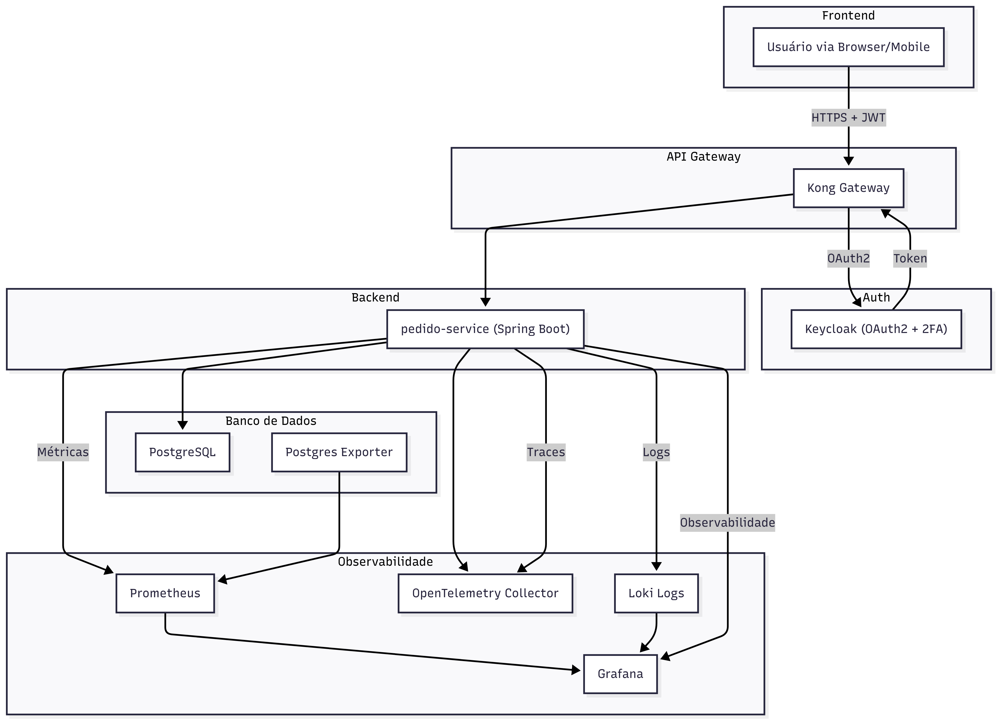

# euComida 

Este projeto implementa o backend de um sistema de delivery inspirado no iFood.


[CHANGELOG](doc/CHANGELOG/CHANGELOG.md)


## Tecnologias Utilizadas

- Java 21
- Spring Boot 3.5
- PostgreSQL 15
- Keycloak (OAuth2 + JWT)
- Kong API Gateway
- Prometheus + Grafana (métricas)
- OpenTelemetry (tracing)
- Loki (logging estruturado)
- Docker e Docker Compose


## Estrutura de Serviços

- `pedido-service`: Serviço de criação e consulta de pedidos
- `./infra/auth`: Keycloak para autenticação e autorização
- `./infra/db`: Banco de dados PostgreSQL
- `./infra/gateway`: Kong como API Gateway
- `./infra/grafana`: Visualização de dashboards (métricas e logs)
- `./infra/monitoring`: Coletor de métricas OpenTelemetry e Prometheus
- `./script/postman`: Collection configurada para chamadas ao Pedido-Service


## Como rodar o projeto

Pré-requisitos:
- Linux ou Windows com WSL
- Git
- Docker
- Docker Compose

Execute:

```bash
git clone https://github.com/fabiohaider/euComida.git
cd euComida
./script/start-docker.sh
./script/infra-docker.sh
```

Script `./script/stop-docker.sh` encerra todos os conteiners Docker.

Após a inicialização, os serviços estarão disponíveis em:

- pedido-service (via gateway): http://localhost:8000/api/v1/pedidos
- Swagger OpenAPI 3: http://localhost:8081/api/v1/swagger-ui/index.html#/
- postgres (5432): via DBeaver ou psql
- postgres-exporter: http://localhost:9187/metrics
- Keycloak: http://localhost:8080
- API Gateway (Kong): http://localhost:8001
- Prometheus:http://localhost:9090
- Grafana: http://localhost:3000
- Loki: (3100): via Grafana
- otel-collector(gRPC 4317):N/A (serviço interno)
- otel-collector(HTTP 4318): N/A (serviço interno)


## Autenticação

- Keycloak com OAuth2 e JWT.
- O Realm exportado está no diretório `./infra/auth`
- Usuários cliente1 e entregador1 estão configurados para autenticação user/passwd e cliente2 autenticar com 2FA
- Para obter um token de acesso, autentique-se via Keycloak e use `Authorization: Bearer <token>`
- Para 2FA necessita antes cadastrar OTP via url `http://localhost:8080/realms/eucomida/account` escanenando o QRCode com algum Authenticator no mobile (Google, Authenticator ...)


## Endpoints da API

### `POST /pedidos`
- Criação de um novo pedido.
```json
{
  "clienteId": "UUID"
}
```
Resposta: objeto `Pedido`

### `GET /pedidos/{id}/status`
- Consulta o status do pedido.

```
http://localhost:8000/api/v1/pedidos/{{pedido_id}}/status
```


## Especificação da Arquitetura de Software

### Arquitetura
A arquitetura segue os princípios da **Clean Architecture** com separação em camadas de domínio, aplicação e infraestrutura.

- **Autenticação (Keycloak)**: Gerenciamento de usuários e tokens JWT.
- **Gateway (Kong)**: API pública com roteamento e segurança centralizada.
- **Serviços backend**: Isolados por responsabilidade com REST APIs.
- **Banco de dados (PostgreSQL)**: Armazenamento relacional com script de inicialização.
- **Observabilidade**:
  - **Métricas**: Prometheus coleta métricas do `pedido-service` e do PostgreSQL.
  - **Dashboards**: Grafana exibe gráficos com painéis prontos.
  - **Tracing**: OpenTelemetry coleta e propaga spans entre serviços.
  - **Logs**: Loki coleta logs estruturados, consultáveis via Grafana.

### Comunicação
- HTTP/REST autenticado via Kong e JWT
- Integração com Prometheus via `/actuator/prometheus`
- OpenTelemetry com exportação automática de tracing


## Monitoramento e Observabilidade

### Prometheus + Grafana
- Prometheus coleta métricas via `/actuator/prometheus` para pedido-service e `/metrics` para postgres-exporter.
- Painéis prontos no Grafana para:
  - Tráfego e latência do `pedido-service`
  - Queries e uso do PostgreSQL
  - Recursos de container (CPU, memória)

### OpenTelemetry
- O `pedido-service` exporta spans automaticamente.
- Tracing integrado com os endpoints REST.
- Integração futura possível com Tempo ou Jaeger.

### Logs estruturados com Loki
- Logs gerados com `structured JSON` no `pedido-service`.
- Enviados ao Loki e visualizados no Grafana.
- Filtros por serviço, nível de log e trace ID.


## Orientações Técnicas para os Times

### Backend
- Expandir novos casos de uso com base na Clean Architecture.
- Seguir padrão de testes com Cucumber + integração.
- Usar logs estruturados e adicionar spans em novos fluxos.
- Criar serviços BFF para consumo do frontend

### Frontend
- Criar SPA com autenticação Keycloak via PKCE.
- Consumir API via BFF entregue pelo time de front com token JWT.
- Painel de status e criação de pedido.

### Mobile
- Aplicativo com login via Keycloak.
- Criação e monitoramento de pedido.
- Notificações push para mudança de status.


## Testes

- Testável via Postman ou curl.
- Autenticação obrigatória via token válido.
- Collection Postman disponível no projeto para importação. Não precisa chamar antes a requisição do token, já está automatizado na rota de POST/GET. Para obter o token por 2FA necessita cadastrar o OTP no endereço mencionado acima e depois colocar o código no campo totp no body da requisição 
- Execução do script auth-test.sh,  autentica no Keyclock pegando token e executa um POST/GET em `pedido-servico`
```bash
./auth-test.sh
```
- Execução do script auth-test-2FA.sh, verifica no Keyclock se usuário já efetuou o cadastro OTP, solicita o código gerando autenticando e pegando o token para execução de POST/GET em `pedido-servico`, caso contrário abre url com QRCode para cadastramento do OTP.
```bash
./auth-test-2FA.sh
```


## Diagrama Solução



